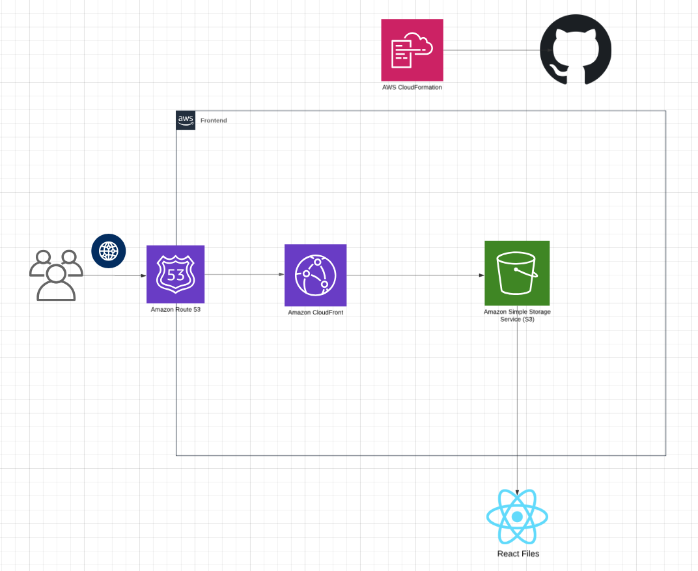
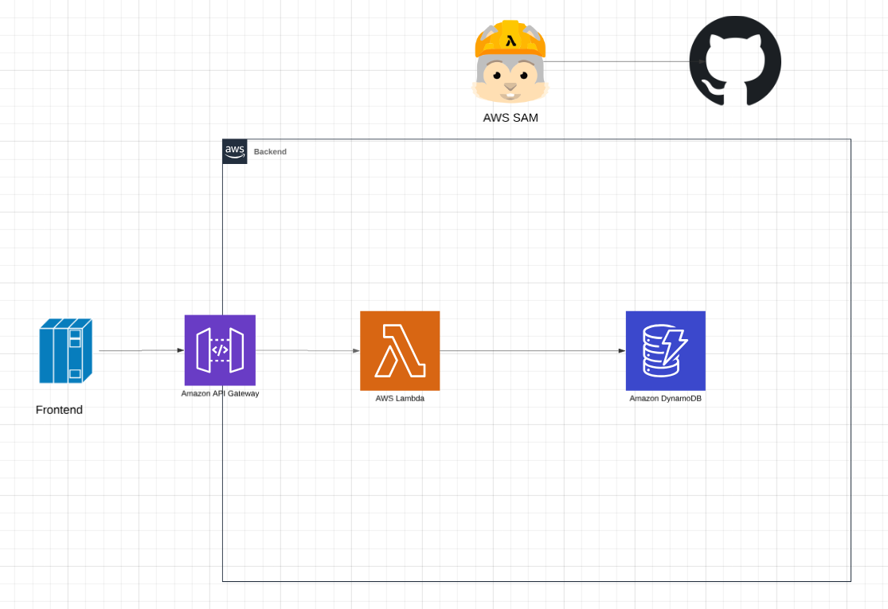

# Cloud Resume Challenge

This project showcases my experience in completing and expanding upon the AWS Cloud Resume Challenge. I thoroughly enjoyed this project as it allowed me to connect my prior knowledge of AWS services to a realistic application.

---

## About the Challenge

The [Cloud Resume Challenge](https://cloudresumechallenge.dev/) is a technical specification that outlines steps to create a single-page resume hosted in the cloud using key AWS services. The website offers multiple separate challenges based on different cloud providers, giving users flexibility to complete the challenge using their preferred tools. Not only is the challenge free to access, but it also provides support resources through a dedicated Discord channel.

---

## Project Architecture

### Frontend

The frontend leverages three main AWS services: S3, Route 53, and CloudFront. Using these services in unison enabled me to host a static webpage under a custom domain, [quinnp.click](https://quinnp.click). Users navigating to the domain are directed via Route 53 to my CloudFront distribution, which retrieves the React static files stored in an S3 bucket. I used CloudFormation and GitHub Actions to automate the deployment process and manage AWS resources.  

---

### Backend

The backend follows a serverless approach to create an API that retrieves the viewer count. The frontend sends an API request that is received by AWS API Gateway. The Gateway routes this request to an AWS Lambda function that handles the logic. Python is used to implement a function responsible for retrieving and updating the viewer count stored in AWS DynamoDB. Once the count is updated, the function returns the value as an API response, which the frontend displays.  

---

### CI/CD

The project utilizes GitHub Actions for CI/CD, ensuring automated and streamlined deployment pipelines for both the frontend and backend.

---

## Challenges

- **Setting Up Role Assumption:** Configuring IAM roles and policies for GitHub Actions was particularly challenging due to the numerous adjustments required to pass this step. I had to consult multiple sources of documentation and YouTube tutorials to correctly set up role assumption privileges.
- **Merging Pipelines:** Combining GitHub Actions pipeline configurations into one presented issues. I had to restructure jobs differently than they were originally set up and resolve conflicts between variable names in the two files.

---

## Add-Ons

During this project, I identified several areas for improvement but prioritized completing the initial specifications before implementing enhancements. This approach allowed me to learn more about reconfiguring AWS services and debugging complex setups.

### Completed

1. **Consolidating Repositories:** Initially, I created two separate GitHub repositories, each with its own pipeline. One major improvement was merging these into a single repository. This required significant reconfiguration of GitHub Actions templates and AWS services, including IAM policies and roles.
2. **Frontend Conversion to React.js:** I transitioned the frontend to React.js. Having extensive experience with React.js and a preference for Material-UI, this change allowed me to build a more interactive and visually appealing website compared to the original static HTML, CSS, and JS setup.

---

### For the Future

1. **Account Logins and Security:** Although not essential for a portfolio or resume website, adding account logins and security features would be a valuable learning experience.
2. **Load Balancing:** Implementing AWS Elastic Load Balancing (ELB) would be a fascinating addition, as I’ve learned a lot about it and find it a powerful concept.
3. **Containerization with Docker:** Setting up CI/CD pipelines with Docker has been challenging in the past, but implementing it in this project would deepen my understanding of containerization.
